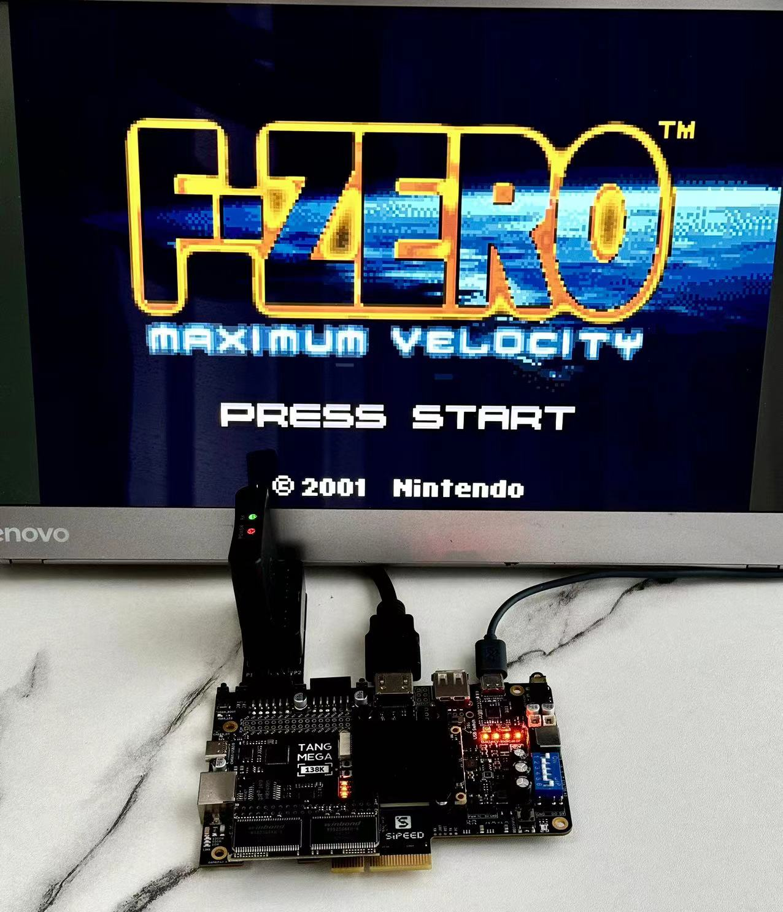

# GBATang - GBA for Sipeed Tang FPGA boards

This is a Game Boy Advance FPGA core for Sipeed [Tang Mega 60K](https://wiki.sipeed.com/hardware/en/tang/tang-mega-60k/mega-60k.html), [Tang Mega 138K](https://wiki.sipeed.com/hardware/en/tang/tang-mega-138k/mega-138k.html), [Mega 138K Pro](https://wiki.sipeed.com/hardware/en/tang/tang-mega-138k/mega-138k-pro.html) and the upcoming Tang Console 60K. 

The core outputs 720p HDMI video, accepts DS2 controller input, and supports all ROM sizes (up to 32MB). An open source BIOS is used so it can be used out of the box. ROMs are loaded from the SD card through a convenient menu system.  

Things-to-do on my list include SNES controller input, and further game compatibility fixes (currently 90 out of top 100 games work).

GBATang is part of [TangCore](https://github.com/nand2mario/tangcore), along with [SNESTang](https://github.com/nand2mario/snestang), [NESTang](https://github.com/nand2mario/nestang) and [MDTang](https://github.com/nand2mario/mdtang).

## Instructions

To install GBATang, follow the [TangCore](https://github.com/nand2mario/tangcore) installation instructions.

## About this project

The project started as a port of the MiSTer GBA core to Tang FPGAs in June 2024. However, it quickly turned into a half-rewrite. By September 2024 it finally reached a usable state and about half of the code is different. Here are the main differences.

* The overall design is a more traditional "FPGA replica" approach, as opposed to the "cycle counting" approach in the MiSTer core. Most modules work at 16Mhz, the GBA main frequency. The MiSTer main frequency is 100Mhz. 
* The CPU is [replaced](https://github.com/risclite/ARM9-compatible-soft-CPU-core), with missing features like 16-bit instructions added. The processor uses a similar pipelined design as the original GBA CPU.
* The memory system is also completely rewritten, as required by the overall design change.
* Timing accuracy could use a lot of improvements. However, as a more "modern" console, GBA mostly uses interrupts and timers to keep time. So cycle-accuracy is not as important as previous consoles.
* A softcore-based menu system is provided, similar to SNESTang and NESTang.

## Documentation

* [Building GBATang part 1 - overall design and CPU](https://nand2mario.github.io/posts/2024/gbatang_part_1/)
* [Building GBATang part 2 - memory system and others](https://nand2mario.github.io/posts/2024/gbatang_part_2/)

## Acknowledgements
* [MiSTer GBA core](https://github.com/MiSTer-devel/GBA_MiSTer) by [Robert Peip](https://github.com/RobertPeip)
* [risclite's CPU core](https://github.com/risclite/ARM9-compatible-soft-CPU-core)

